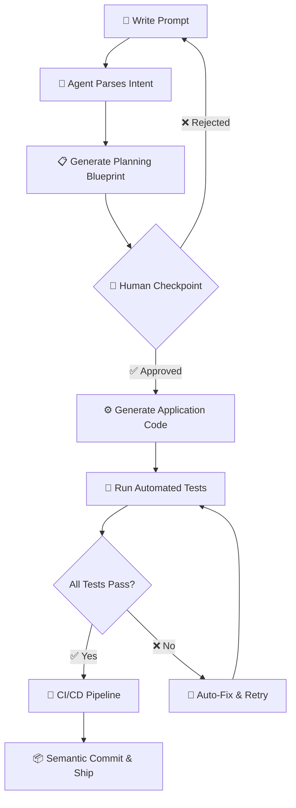

<div align="center">

<!-- Hero Banner -->


<br/>

<!-- Badges Row -->
[](LICENSE)
[](https://code.visualstudio.com/)
[](https://github.com/tailorgunjan93/ai-coding-agent)
[](https://github.com/tailorgunjan93/ai-coding-agent/pulls)
[](https://github.com/tailorgunjan93/ai-coding-agent)

<br/>

> ### 🤖 An open-source AI coding agent for VS Code that turns prompts into production-ready applications — complete with tests, design patterns, and human-in-the-loop checkpoints.

<br/>

</div>

---

## 📋 Table of Contents

- [✨ Features](#-features)
- [🏗️ Architecture](#️-architecture)
- [📁 Project Structure](#-project-structure)
- [🚀 Getting Started](#-getting-started)
- [🔄 Workflow](#-workflow)
- [🧪 Testing Strategy](#-testing-strategy)
- [📋 Planning Template](#-planning-template)
- [🤝 Contributing](#-contributing)
- [📄 License](#-license)

---

## ✨ Features

<div align="center">

| 🎯 Feature | 📝 Description |
|:---:|:---|
| 🧠 **Prompt-to-App** | Generate complete, runnable applications from a single natural language prompt |
| 🔧 **Codebase Enhancement** | Intelligently refactor and enhance your existing code with AI suggestions |
| 🏆 **Production-Grade Quality** | Enforces best practices, design patterns (MVC, Repository, Factory), and clean architecture |
| 🧪 **Continuous Testing** | Auto-generates unit, integration, and edge-case tests for every feature |
| 👤 **Human-in-the-Loop** | Built-in approval checkpoints keep you in control of critical decisions |
| 🔁 **CI/CD Ready** | Includes CI configuration for seamless pipeline integration |
| 💬 **Semantic Commits** | Enforces conventional commits for a clean, readable Git history |

</div>

---

## 🏗️ Architecture

```
┌─────────────────────────────────────────────────────────┐
│                    🧠 AI Coding Agent                    │
│                                                         │
│  ┌─────────────┐    ┌─────────────┐    ┌─────────────┐  │
│  │   Prompt    │───▶│   Planner   │───▶│  Generator  │  │
│  │   Parser    │    │  Blueprint  │    │   Engine    │  │
│  └─────────────┘    └─────────────┘    └─────────────┘  │
│                            │                   │         │
│                            ▼                   ▼         │
│                    ┌─────────────┐    ┌─────────────┐    │
│                    │   Human     │    │   Testing   │    │
│                    │  Checkpoint │    │   Runner    │    │
│                    └─────────────┘    └─────────────┘    │
│                            │                   │         │
│                            └─────────┬─────────┘         │
│                                      ▼                   │
│                            ┌─────────────────┐           │
│                            │  CI/CD Pipeline │           │
│                            │   & Semantic    │           │
│                            │     Commits     │           │
│                            └─────────────────┘           │
└─────────────────────────────────────────────────────────┘
```

### Design Patterns Applied

- 🏛️ **MVC** — Clean separation of concerns
- 📦 **Repository Pattern** — Abstracted data access layer
- 🏭 **Factory Pattern** — Flexible object creation
- 🔌 **Plugin Architecture** — Extensible VS Code integration

---

## 📁 Project Structure

```
ai-coding-agent/
├── 📁 .github/              # GitHub workflows & community files
├── 📁 .kilo/
│   └── 📁 plans/            # Agent execution plans
├── 📁 .vscode/              # VS Code workspace settings
├── 📁 PlanningBluePrint/    # Planning templates & blueprints
├── 📁 agent-graphs/         # Agent workflow graph definitions
├── 📁 ci/                   # CI/CD pipeline configuration
├── 📁 db/                   # Database schemas & migrations
├── 📁 docs/                 # Documentation & guides
├── 📁 src/                  # Core agent source code
├── 📄 planning.md           # Project planning template
├── 📄 LICENSE               # MIT License
└── 📄 README.md             # You are here!
```

---

## 🚀 Getting Started

### Prerequisites

```bash
# Node.js 18+ required
node --version  # v18.0.0+

# VS Code
code --version
```

### Installation

```bash
# 1. Clone the repository
git clone https://github.com/tailorgunjan93/ai-coding-agent.git
cd ai-coding-agent

# 2. Install dependencies
npm install

# 3. Open in VS Code
code .
```

### Quick Start

```bash
# Run the agent with a prompt
npm run agent -- "Build a REST API with authentication and CRUD for a blog"

# Enhance existing code
npm run enhance -- --path ./src --mode refactor
```

---

## 🔄 Workflow



---

## 🧪 Testing Strategy

The agent enforces a **three-tier testing approach** for every generated feature:

<div align="center">

| 🔬 Test Type | 📋 Coverage | 🎯 Goal |
|:---:|:---:|:---|
| **Unit Tests** | Per function | Verify individual logic in isolation |
| **Integration Tests** | Per workflow | Ensure components work together |
| **Edge Case Tests** | Invalid inputs & stress | Harden against unexpected conditions |

</div>

```bash
# Run the full test suite
npm test

# Run with coverage report
npm run test:coverage

# Run specific test types
npm run test:unit
npm run test:integration
npm run test:edge
```

---

## 📋 Planning Template

Every project generated by the agent starts with a structured planning document:

```markdown
# Project Planning Document

## 1. Overview
Describe the purpose of the application or enhancement.

## 2. Requirements
- Functional requirements
- Non-functional requirements
- Dependencies

## 3. Architecture
- Tech stack
- Design patterns applied (e.g., MVC, Repository, Factory)
- Modules/components

## 4. Tasks
- [ ] Create initial scaffolding
- [ ] Implement core features
- [ ] Add database schema/migrations
- [ ] Write unit/integration/edge tests
- [ ] Configure CI/CD pipeline
- [ ] Commit changes with semantic messages

## 5. Testing Strategy
- Unit tests per function
- Integration tests per workflow
- Edge-case tests (invalid inputs, stress)

## 6. Approval
Human-in-the-loop checkpoint:
✅ Approved by: __________
🕒 Date: __________
```

---

## 🤝 Contributing

Contributions are what make the open-source community such an amazing place! Any contribution you make is **greatly appreciated**.

1. 🍴 **Fork** the repository
2. 🌿 **Create** your feature branch (`git checkout -b feat/amazing-feature`)
3. 💾 **Commit** your changes using semantic commits (`git commit -m 'feat: add amazing feature'`)
4. 📤 **Push** to the branch (`git push origin feat/amazing-feature`)
5. 🔃 **Open** a Pull Request

### Commit Convention

```
feat:     ✨ New feature
fix:      🐛 Bug fix
docs:     📚 Documentation update
style:    💅 Code style / formatting
refactor: ♻️  Code refactoring
test:     🧪 Adding tests
ci:       🔧 CI/CD changes
```

---

## 📄 License

Distributed under the **MIT License**. See [`LICENSE`](LICENSE) for more information.

---

<div align="center">


**Made with ❤️ by [tailorgunjan93](https://github.com/tailorgunjan93)**

⭐ **Star this repo if you find it useful!** ⭐

[](https://github.com/tailorgunjan93/ai-coding-agent/stargazers)
[](https://github.com/tailorgunjan93/ai-coding-agent/network/members)

</div>
